# 数据流转示意图
> * 从输入的fasta到输出的xyz
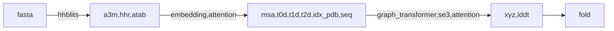
# a3m,hhr,atab生成(初步数据生成)
> * 使用传统软件hhblits,hhsearch生成
> * 涉及工具,hhblits,cabuild
> * 需要用大量的数据库，解压完大约2T
> * a3m
>> * 感觉是压缩过的hhblits输出结果
> * atab
>> * 感觉是每一个对齐位置的打分信息,每个pdb对其fasta中的某一段
> * hhr
>> * 匹配的pdb的打分信息, dssp不知道是啥
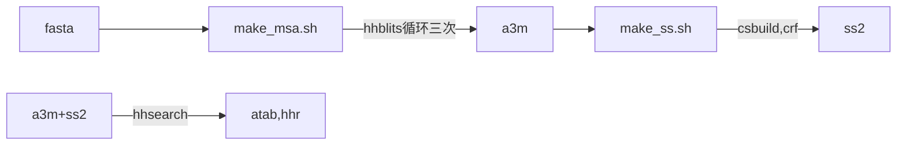
# 初步特征构造
> * 使用a3m,hhr, atab生成msa, t1d, t2d, seq等特征
> * msa构造
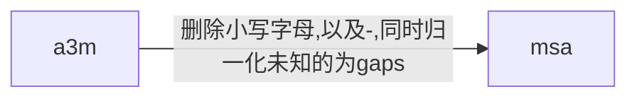
> * t0d构造
>> * 维度为3
>> * 也是来自hhblits，来自hhr， 使用的是Probab,Identities,Similarity
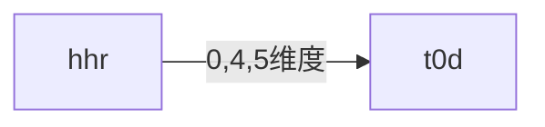
> * t1d构造
>> * 维度为L * 3
>> * 使用atab的打分信息
>> * atab中每个位置的对应pdb中打分
>> * 怀疑最后取得分数是直接覆盖，而不是取平均值
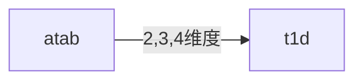
> * xyz构造
>> * xyz 是从每个pdb中解码得到的
>> * 先参考pdb中的主干xyz
>> * rosettafold是先预测3个主干的坐标,然后再添加其他坐标
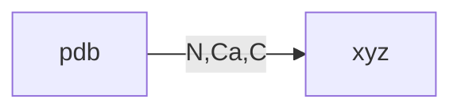
> * t2d构造
>> * 主要使用xyz_t坐标
>> * 由于骨架是3个点,因此构成三角形,需要距离和角度信息表达 
>> * 距离维度为1
>> * 角度为度为6, sin, cos
>> * 加上t0d的数据(疑问，不知道怎么加的)
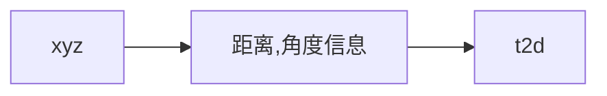
> * seq构造
>> * 没啥说的，直接用msa得到的
>> * 疑问,为啥取得是每个msa的[0]
> * idx_pdb
>> * 这个就是1...L
# 初步模型识别
> * 整理流程
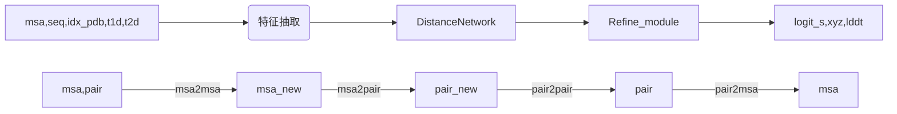
> * 送到模型前特征处理
>> * 这里的msa已经开始使用encoding
>> * QueryEncoding 不理解
>>> * (0 for query, 1 for others) 啥意思,加这个干啥呢
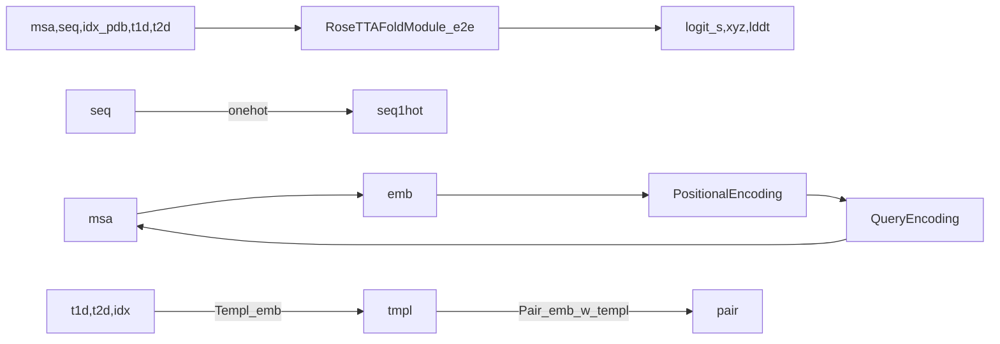
> * 特征抽取IterativeFeatureExtractor
>> * Templ_emb 中把输入的templ做了归一
>> * 已经可以作为中间结果输出了，感觉是2dtrack
>> * 用了graph transformer, se3transformer,这两个经常会一致出现
>> * msa,pair互相attention
>> * Iterative MSA feature extraction,这个是特征抽取的核心
>>> * MSA2Pair
>>>> * 感觉是自己attention
>>> * MSA2MSA
>>>> * EncoderLayer
>>>> * performer encode
>>>> * 快速attetion，用于提高效率
>>> * Pair2MSA
>>>> * DirectEncoderLayer
>>> * Pair2Pair
>>>> * 用的是selfAttention
>>>> * AxialEncoderLayer
>>> * Str2Str
>>>> * 使用了se3
>>>> * make_graph
>>>> * graph transformer
>>> * Str2MSA
>>>> * MaskedDirectMultiheadAttention
>> * 疑问
>>> * msa,pair互相attention的流程
>>> * graph的构造，以及se3的使用流程
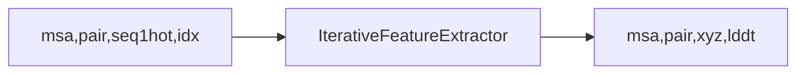
> * 模型预测DistanceNetwork
>> * 使用4个resnet抽取特征
>> * 输出的是L * L * 130的矩阵分布信息
> * 模型Refine_module
>> * lddt是什么
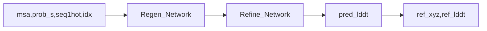
> * 模型fold
>> * 使用adam
>> * 疑问，不知道是否使用了力场
> * 主要技术方案
>> * 基础特征生成(fasta)
>>> * hhblits, hhsearch
>> * 特征关联
>>> * embedding(msa)(21 * 64)
>>> * template embeding(用于pair生成)
>>> * template embeding 同时使用了attention，encoding(参考transformer的encode过程)
>> * 特征迭代抽取
>>> * 主要使用attention, msa,pair,
>>> * 同时使用graph TransformerConv, se3
>> * 距离分布预测
>>> * 4个resnet, 针对pair信息
>>> * 疑问,卷积的维度为啥是指定的那些
>> * refine
>>> * graph TransformerConv, se3
>> * fold
>>> * adam
>>> * 应该是算了三个角度，以及其他几个的损失
>> * 相关transofrmer
>>> * AxialTransformer
>>> * performer 应该是快速transformer,加速用的
>>> * se3
>>>> * se3是用于图坐标的重新矫正,但是在rosettafold里边，输入坐标
>>> * transformerCONV UniMPBlock 使用图节点和边特征的半监督分类 https://zhuanlan.zhihu.com/p/370357388
>>>> * 标签传播算法，使用迭代的方法进行标签传播
>>>>> * 基本思想：当前节点的标签取决于相连的点中标签最多的那个标签。通过迭代的方式， 更新节点标签，类似于聚类算法
>>>> * transformerCONV
>>>>> * 图transformer。在这里只是用作特征提取
> * 图的理解
>> * 点:每个氨基酸的ca节点
>> * 边特征:两两氨基酸之间的特征信息，例如距离，角度，hhr打分等等。 经过linear全连接之后，估计是64维度
>> * 图，使用点和边的特征进行特征抽取，最后输出每个节点的特征，核心目的是抽出每个氨基酸的特征
> * 两次用图
>> * 第一次用图生成特征以及初始坐标.边的特征是pair信息
>> * 第二次是在refine的时候用的图，边的特征是feat_extract中生成的分布信息
>> * 这两次使用的都是torch_geometric
>> * se3中使用的是dgl